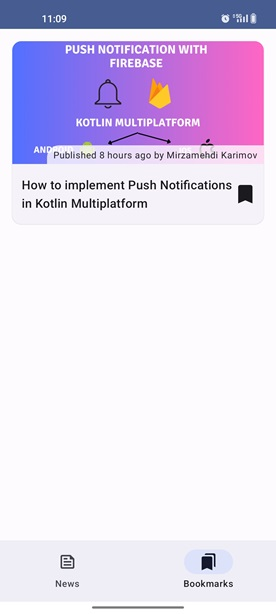

# ProAndroidDev Reader
A demo application to show Android articles from https://proandroiddev.com/.

 

If you found the articles are useful, please support writers by subscribing to the website. Thank you.

# Technical information
- Architecture: MVVM
- Dependency Injection: Hilt
- Build Management: Gradle Kotlin DSL, Version Catalog
- UI: Jetpack Compose
- Image Loader: Coil
- Network: Ktor
- Serialization: Kotlinx Serialization
- DateTime: Threetenabp
- Logging: Timber
- Unit Test: assertk, mockito-kotlin, turbine
- UI Test: Kakao Compose
- more...

# Upcoming features
- ~~Bookmark articles~~ DONE
- Get a notification when there is a new news
- more...
